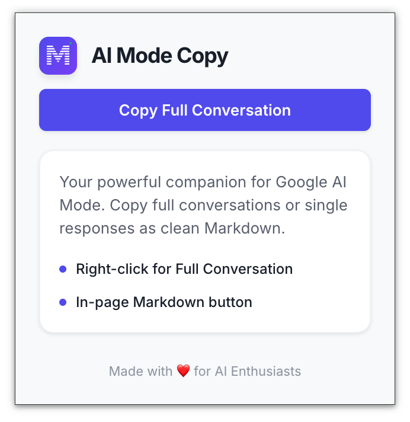
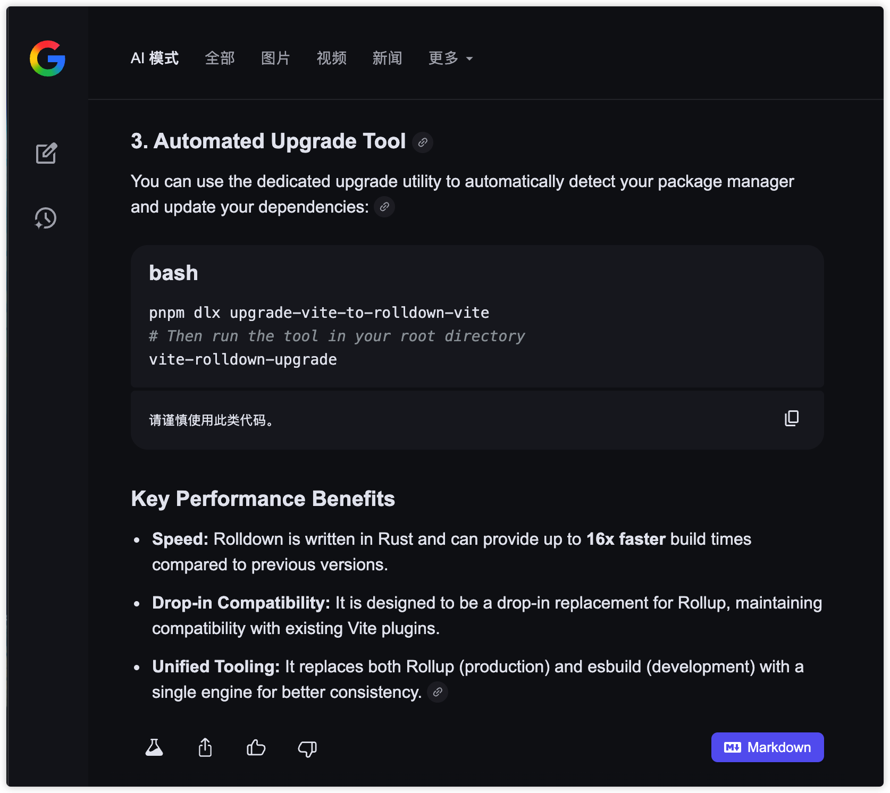
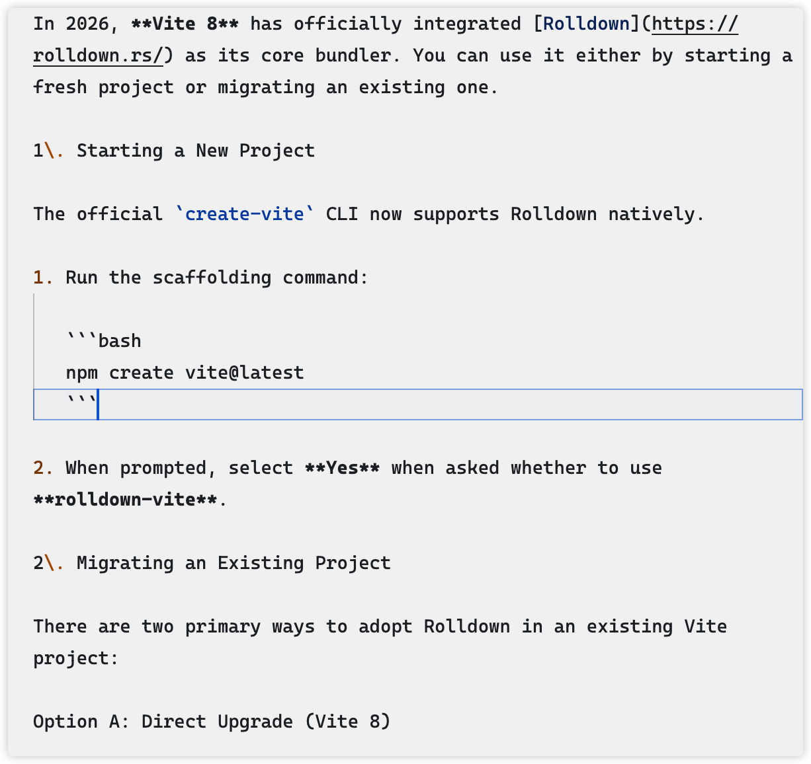

# AI Mode Copy

<p align="center">
  
</p>

<p align="center">
  <strong>🚀 一键复制 Google AI Mode 回复为 Markdown 格式</strong>
</p>

<p align="center">
  <a href="#为什么需要这个插件">为什么</a> •
  <a href="#功能特性">功能</a> •
  <a href="#安装方法">安装</a> •
  <a href="#使用方法">使用</a> •
  <a href="#关于构建">关于</a>
</p>

<p align="center">
  <a href="README.md">🇬🇧 English Documentation</a>
</p>

---

## 为什么需要这个插件？

### 😤 问题：AI Mode 的复制体验极其糟糕

Google AI Mode (Search Labs) 是一个强大的AI搜索工具，但它有一个让人抓狂的问题：

> **你无法复制AI回复的内容！**

- ❌ **无法选中文本** - 尝试选中AI回复的文字？对不起，做不到
- ❌ **无法复制Markdown** - 即使你想办法选中了，复制出来的也是纯文本，所有格式都丢失了
- ❌ **代码块无法复制** - 虽然代码块有复制按钮，但整体回复没有
- ❌ **无法保存对话** - 想把AI的精彩回答保存下来？只能截图...

这对于需要**记录笔记**、**整理文档**、**分享内容**的用户来说，简直是噩梦！

### ✅ 解决方案：AI Mode Copy

这个Chrome扩展完美解决了上述所有问题：



只需点击AI回复底部的 **Markdown** 按钮，即可一键复制格式完美的Markdown内容：



---

## 功能特性

- ✅ **一键复制** - 在AI回复footer添加醒目的"Markdown"按钮
- ✅ **智能转换** - 自动将HTML内容转换为标准Markdown格式
- ✅ **完整格式支持**：
  - 标题（H1-H6）
  - 段落和换行
  - 列表（有序/无序）
  - 代码块（保留语言标识）
  - 加粗、斜体
  - 链接
  - 引用块
  - 表格
- ✅ **右键菜单** - 支持复制完整对话
- ✅ **弹出窗口** - 点击扩展图标即可快速复制

---

## 安装方法

### 开发者模式加载

1. 克隆或下载此仓库
   ```bash
   git clone https://github.com/MatrixAges/ai-mode-copy.git
   cd ai-mode-copy
   ```

2. 安装依赖并构建
   ```bash
   pnpm install
   pnpm run build
   ```

3. 打开Chrome浏览器，访问 `chrome://extensions/`

4. 开启右上角的 **"开发者模式"**

5. 点击 **"加载已解压的扩展程序"**

6. 选择项目的 `dist` 目录

7. 完成！🎉

---

## 使用方法

### 方法一：点击Markdown按钮（推荐）

1. 访问 Google Search 并使用 AI Mode
2. 在AI回复的底部会自动出现 **"Markdown"** 按钮
3. 点击按钮即可复制当前回复的Markdown格式
4. 复制成功后按钮会显示 ✓

### 方法二：使用扩展弹出窗口

1. 点击浏览器工具栏中的扩展图标
2. 点击 **"Copy Full Conversation"** 复制整个对话

### 方法三：使用右键菜单

1. 在AI Mode页面上右键点击
2. 选择 **"复制完整对话（Markdown）"** 或 **"复制当前回复（Markdown）"**

---

## 技术栈

- **前端框架**：React 18 + TypeScript
- **构建工具**：Vite
- **Chrome扩展**：Manifest V3
- **HTML转换**：自研Markdown转换器

---

## 关于构建

<p align="center">
  
</p>

### 🤖 100% AI Coding 驱动

**这个项目完全由 AI Coding 构建！**

本项目使用 [**Antigravity**](https://deepmind.google/) —— Google DeepMind 开发的先进 AI Coding 助手进行开发。从项目初始化、架构设计、功能实现到文档编写，**整个开发过程没有手写一行代码**。

这是对 AI Coding 能力的一次真实验证：

- 📝 **需求理解** - AI 准确理解了"解决AI Mode无法复制"的痛点
- 🏗️ **架构设计** - AI 设计了清晰的Chrome扩展架构（content script + background + popup）
- 💻 **代码实现** - AI 完成了HTML到Markdown转换器、React组件、Chrome API集成
- 🐛 **问题修复** - AI 迭代修复了DOM选择器、样式注入、格式转换等问题
- 📖 **文档编写** - 你正在阅读的这份README也是AI生成的

> **AI 写代码来解决 AI 产品的问题** —— 这很meta，不是吗？ 😄

---

## 项目结构

```
ai-mode-copy/
├── src/
│   ├── content/           # Content Script（注入到页面）
│   │   ├── index.tsx      # 入口文件
│   │   └── MarkdownButton.tsx
│   ├── background/        # Background Service Worker
│   │   └── index.ts
│   ├── popup/             # 扩展弹出窗口
│   │   ├── index.tsx
│   │   ├── Popup.tsx
│   │   └── popup.css
│   └── utils/             # 工具函数
│       ├── converter.ts   # HTML → Markdown 转换器
│       └── extractor.ts   # DOM内容提取
├── public/
│   ├── manifest.json      # Chrome扩展配置
│   └── icons/             # 扩展图标
├── images/                # README截图
├── dist/                  # 构建输出
└── package.json
```

---

## 许可证

MIT License - 自由使用、修改、分发

---

## 贡献

欢迎提交 Issue 和 Pull Request！

无论你是想报告Bug、提出新功能建议，还是直接贡献代码，我们都非常欢迎！

---

<p align="center">
  Made with ❤️ for AI Enthusiasts
</p>

<p align="center">
  <sub>Powered by Antigravity AI Coding Assistant</sub>
</p>
